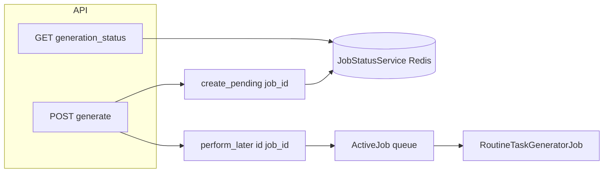
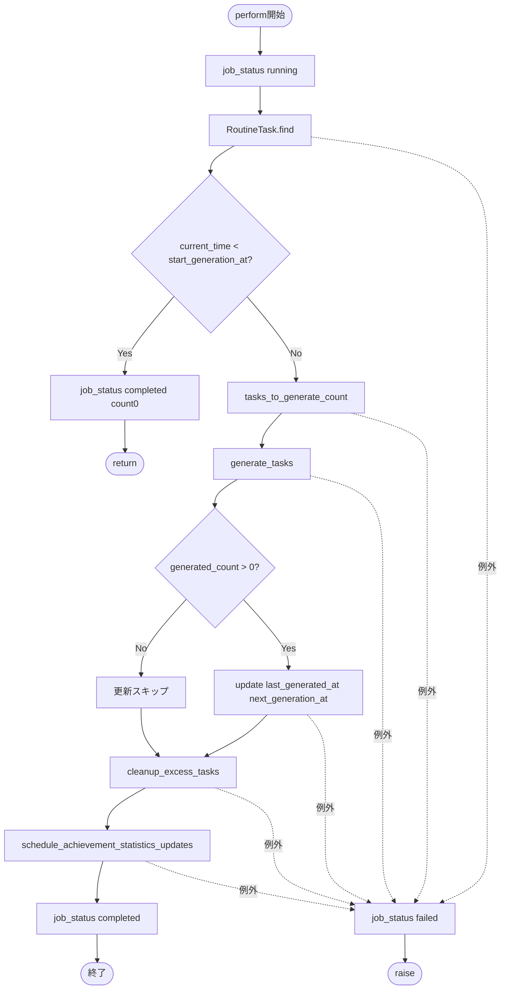
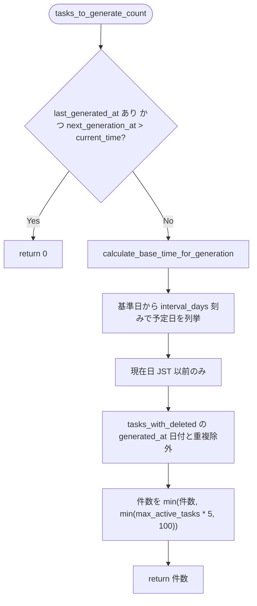
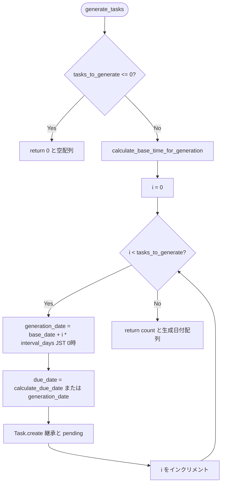

# 習慣化タスク生成の仕様

## 概要

`RoutineTaskGeneratorJob` は、習慣化タスク（`RoutineTask`）から定期的にタスク（`Task`）を生成するジョブです。

## 生成フロー

### Step 0: 開始期限のチェック
- `current_time < start_generation_at` の場合、何も生成せずに終了
- ジョブステータスを `completed` に更新（`generated_tasks_count: 0`）

### Step 1: 生成すべきタスク数を計算
- `routine_task.tasks_to_generate_count(current_time)` で計算
- `next_generation_at > current_time` の場合、0を返す
- 基準日時の決定：
  - `last_generated_at` が未設定の場合（最初の生成時）：`start_generation_at` を基準日時として使用
  - それ以外の場合：`last_generated_at` を基準日時として使用
- 生成すべきタスク数の計算：
  - 最初の生成時（`last_generated_at`が未設定）: `((current_time - base_time) / interval_days).floor + 1`
    - 開始日を含めるため、計算結果に1を加算
    - 例: 1/1から1/3まで（2日経過）の場合、1/1, 1/2, 1/3の3つのタスクを生成
  - 2回目以降: `((current_time - base_time) / interval_days).floor`
    - `last_generated_at`から現在時刻までの経過日数に基づいてタスク数を計算
- **上限**: システム障害やジョブ失敗による長期間の停止を考慮し、合理的な上限を設定
  - 上限値は `[max_active_tasks * 5, 100].min` で計算される
  - これにより、1回のジョブ実行で生成されるタスク数が過剰になることを防ぐ
  - 例：`max_active_tasks = 10` の場合、上限は `min(10 * 5, 100) = 50` となる

### Step 2: タスクを生成
- `tasks_to_generate > 0` の場合のみ実行
- **重要**: Step 1で計算されたタスク数（上限を考慮済み）を全て生成する

#### 基準日時の決定
- 最初の生成時（`last_generated_at` が `nil`）：`start_generation_at` を使用
- 2回目以降：`last_generated_at` を使用

#### 生成日時の計算
- `generation_date = base_time + (i * interval_days).days`
- `i` は0から始まるループカウンタ
- **最初の生成時は開始日を含める**: `i=0`のときは開始日（`start_generation_at`）そのものが生成される
- 例: 1/1を開始日として1/3に初生成する場合、1/1, 1/2, 1/3の3つのタスクが生成される

#### 期限日時の計算
- すべてのタスクで生成日時（`generation_date`）を基準に期限を計算
- `due_date = calculate_due_date(generation_date) || generation_date`
- **開始日を含めるように変更したため、最初のタスクも生成日時を基準にする**
  - 最初のタスクの`generation_date`は開始日（`start_generation_at`）そのものなので、開始日を基準に計算したのと同じ結果になる

#### タスクの作成
- `account_id`: `routine_task.account_id` を継承
- `routine_task_id`: `routine_task.id` を設定
- `title`: `routine_task.title` を継承
- `due_date`: 上記で計算した期限日時
- `priority`: `routine_task.priority` を継承
- `category_id`: `routine_task.category_id` を継承
- `status`: 常に `'pending'`（未着手）
- `generated_at`: 上記で計算した生成日時

### Step 3: last_generated_atとnext_generation_atを更新
- `last_generated_at`: `current_time` に更新
- `next_generation_at`: `calculate_next_generation_at(current_time)` で計算
  - `current_time + interval_days.days`

### Step 4: max_active_tasksを超えている場合、古いタスクを削除
- `cleanup_excess_tasks(routine_task)` を実行
- **重要**: タスク生成後に実行されるため、生成されたタスクも含めて上限チェックが行われる

#### cleanup_excess_tasks の仕様
1. 未完了タスクを取得（論理削除済みを除く）
   - `routine_task.tasks.where.not(status: 'completed')`
2. 超過数を計算
   - `excess_count = incomplete_tasks.count - max_active_tasks`
3. 超過している場合、以下の順序で削除：
   - **優先1**: 期限超過タスク（`due_date < current_time`）を取得
     - `created_at` でソート（古い順）
     - `order(created_at: :asc)`
   - **優先2**: 期限超過タスクが不足する場合、期限前タスクも取得
     - `due_date >= current_time` または `due_date IS NULL` のタスク
     - `created_at` でソート（古い順）
     - `order(created_at: :asc)`
4. 削除対象タスクを論理削除
   - `Task.unscoped.where(id: tasks_to_delete_ids).update_all(deleted_at: Time.current)`

**削除順序:**
1. 期限超過タスクを優先的に削除（`created_at`が古い順）
2. 期限超過タスクを全て削除してもまだ超過している場合、期限前タスクも削除（`created_at`が古い順）
3. 期限が設定されていないタスク（`due_date IS NULL`）は、期限前タスクとして扱われる

### Step 5: ジョブステータスを更新
- `JobStatusService` により Redis にジョブステータスを保存
- `status`: `'running'`（実行中）、`'completed'`（完了）、`'failed'`（失敗）
- `generatedTasksCount`: 生成されたタスク数
- `completedAt`: 完了日時
- エラー時は `error` メッセージも保存

### 実装の責務分担
- **RoutineTaskGeneratorJob**: 各ステップを private メソッドに分割
  - `check_start_generation_at`: 開始期限チェック
  - `calculate_tasks_to_generate`: 生成数計算
  - `generate_tasks`: タスク生成ループ
  - `update_routine_task_after_generation`: last_generated_at / next_generation_at 更新
  - `cleanup_excess_tasks`: 超過タスクの削除
- **JobStatusService**: Redis へのジョブステータス保存・取得を集約
  - `create_pending(job_id)`: 初期ステータス保存（コントローラーの generate で使用）
  - `update(job_id, status:, completed:, **options)`: ステータス更新
  - `find(job_id)`: ステータス取得（コントローラーの generation_status で使用）

## 頻度（frequency）の仕様

### daily
- `interval_days = 1`

### weekly
- `interval_days = 7`

### monthly
- `interval_days = 30`

### custom
- `interval_days = interval_value || 1`
- `interval_value` が必須（バリデーション）

## 期限オフセットの仕様

### due_date_offset_days
- 期限日の日数オフセット（0以上）
- `nil` の場合はオフセットなし

### due_date_offset_hour
- 期限日の時オフセット（0-23）
- `nil` の場合はオフセットなし

### calculate_due_date の計算ロジック
1. `base_date` を日付に変換（`beginning_of_day`）
2. `due_date_offset_days` が設定されている場合、その日数を加算
3. `due_date_offset_hour` が設定されている場合、その時間を加算
4. 結果を返す

## テストケースの整理

### 1. 正常系
- [x] 新しいタスクを生成すること
- [x] `last_generated_at` と `next_generation_at` を更新すること
- [x] ジョブステータスをRedisに保存すること
- [x] `max_active_tasks` を超えないようにタスクを生成すること
- [x] カテゴリと優先度を継承したタスクを生成すること
- [x] `max_active_tasks` を超過している場合、古いタスクを削除すること
- [x] 完了タスクは削除対象にならないこと

### 2. 異常系
- [x] `routine_task` が見つからない場合、エラーを発生させること
- [x] エラーが発生した場合、ジョブステータスを `failed` に更新すること

### 3. エッジケース
- [x] 前回生成日時が未設定の場合、`start_generation_at`から現在時刻までのタスクを生成すること
- [x] `max_active_tasks` に達している場合でも、新しいタスクを生成し、上限に収まるように削除すること
- [x] `weekly` 頻度で正しくタスクを生成すること
- [x] `custom` 頻度で正しくタスクを生成すること

### 4. 期限オフセット
- [x] 2回目以降の生成では生成日時を基準に期限を計算すること
- [x] 最初のタスク生成時は開始日を基準に期限を計算すること
- [x] 時のみ設定されている場合、日は0になること

### 5. 開始期限
- [x] 開始期限に達していない場合はタスクを生成しないこと
- [x] 開始期限に達している場合はタスクを生成すること
- [x] 開始期限が設定されている場合、`start_generation_at` を基準にタスクを生成すること

### 6. 期限超過タスクの削除
- [x] 期限超過タスクが優先的に削除されること
- [x] 期限超過タスクが複数ある場合、作成順（`created_at`が古い順）に削除されること
- [x] 期限超過タスクがない場合、`created_at` が古い順に削除されること
- [x] 期限が設定されていないタスクは、期限超過タスクより後に削除されること

## 重要な変更履歴

### 2025-01-XX: 最初の生成時に開始日を含めるように変更
**変更内容**: 最初の生成時に開始日（`start_generation_at`）を含めてタスクを生成するように変更

**変更前のロジック:**
- 生成日時の計算: `generation_date = base_time + ((i + 1) * interval_days).days`
- 開始日は生成されず、開始日の翌日から生成される
- 例: 1/1を開始日として1/3に初生成する場合、1/2, 1/3の2つのタスクが生成される

**変更後のロジック:**
- 生成日時の計算: `generation_date = base_time + (i * interval_days).days`
- 最初の生成時は開始日を含めて生成される
- タスク数の計算: `((current_time - base_time) / interval_days).floor + 1`（最初の生成時のみ）
- 例: 1/1を開始日として1/3に初生成する場合、1/1, 1/2, 1/3の3つのタスクが生成される

**変更理由:**
- 開始日を含めることで、より直感的で自然な動作になる
- 開始日から数えて1日目が欠けることがなくなる

### 2025-01-XX: 最初の生成時のタスク生成ロジック変更
**変更内容**: 最初の生成時も、`start_generation_at`から現在時刻までのタスクを全て生成するように変更

**変更前のロジック:**
- `last_generated_at` が未設定の場合（最初の生成時）、1件のみ生成
- 長期間経過後に最初の生成を行う場合でも、1件しか生成されない

**変更後のロジック:**
- `last_generated_at` が未設定の場合（最初の生成時）、`start_generation_at` を基準日時として使用
- `start_generation_at` から現在時刻までの経過日数に基づいてタスク数を計算（開始日を含める）
- 上限（`max_active_tasks * 5` と `100` の最小値）も適用される

**変更理由:**
- 最初の生成時にも、開始日時から現在時刻までに生成すべきタスクを全て生成できるようにする
- 長期間経過後に最初の生成を行う場合でも、適切な数のタスクが生成される

### 2025-12-31: 削除ロジックの改善
**変更内容**: 期限超過タスクを優先的に削除するように変更

**変更前のロジック:**
- `created_at` でソート（古い順）して削除
- 期限超過タスクが優先的に削除されない
- 期限超過の新しいタスクが残り、期限前の古いタスクが削除される可能性がある

**変更後のロジック:**
- 期限超過タスクを優先的に削除（`created_at`が古い順）
- 期限超過タスクを全て削除してもまだ超過している場合、期限前タスクも削除（`created_at`が古い順）
- 期限が設定されていないタスクは、期限前タスクとして扱われる

**変更理由:**
- 期限超過タスクを優先的に削除することで、より適切なタスク管理を実現
- 期限超過タスクの中では作成順に削除することで、公平性を保つ

### 2025-12-31: ロジック変更
**変更内容**: 上限に関係なくタスクを生成し、その後削除する方式に変更

**変更前のロジック:**
- 現在の未完了タスク数を取得
- 利用可能なスロット数を計算（`max_active_tasks - current_active_count`）
- 生成すべきタスク数と利用可能なスロット数の最小値を生成
- 上限を超えないようにタスクを生成

**変更後のロジック:**
- 実行時点までに生成すべきタスク数を計算（上限に関係なく）
- 計算されたタスク数を全て生成（上限に関係なく）
- 生成後、`max_active_tasks`を超えている場合、期限超過タスクを優先的に削除

**変更理由:**
- より確実にタスクを生成できるようにする
- 上限チェックを生成後にまとめて行うことで、ロジックを簡素化

### 2025-01-XX: 生成数の上限を追加
**変更内容**: `tasks_to_generate_count`メソッドに合理的な上限を追加

**変更前のロジック:**
- 計算されたタスク数をそのまま返す
- システム障害やジョブ失敗により長期間停止した場合、数百〜数千のタスクを生成する可能性がある
- データベーストランザクションタイムアウト、メモリ圧迫、過剰なコールバック実行のリスクがある

**変更後のロジック:**
- 計算されたタスク数に上限を設定：`[calculated_count, max_active_tasks * 5, 100].min`
- システム障害後の大量生成を防ぎつつ、通常のケースでは十分なタスクを生成できる

**変更理由:**
- システム障害やジョブ失敗による長期間の停止を考慮し、1回のジョブ実行で生成されるタスク数を制限
- データベーストランザクションタイムアウトやメモリ圧迫を防ぐ
- すぐに論理削除されるタスクの過剰なコールバック実行を防ぐ

## フロー図（Mermaid）

以下は実装（`RoutineTaskGeneratorJob`、`RoutineTask`）に基づくフロー図である。生成件数の詳細は **`tasks_to_generate_count` のコードを正**とする（本文 Step 1 の数式説明が古い場合がある）。

### 全体像（API からジョブまで）

`RoutineTasksController#generate` が `job_id` を発行し、Redis に pending を保存したうえで `RoutineTaskGeneratorJob.perform_later` を実行する。

### メインフロー: `RoutineTaskGeneratorJob#perform`

補足:

- 開始前は `current_time < start_generation_at` なら生成せず `generated_tasks_count: 0` で完了する。
- `last_generated_at` / `next_generation_at` の更新は **`generated_count > 0` のときのみ**。
- `cleanup_excess_tasks` は生成の有無にかかわらず実行する。
- 生成日・削除日から週次・月次の組ごとに `UpdateAchievementStatisticsJob` を `perform_later` する。

### 生成数算出: `RoutineTask#tasks_to_generate_count`

`calculate_base_time_for_generation` の基準:

- `last_generated_at` があり、かつ `next_generation_at <= current_time` → `next_generation_at` の JST 始まりの日を基準にする。
- `last_generated_at` あり、`next_generation_at > current_time` → `last_generated_at`（多くは上記ガードで先に 0 を返す）。
- 初回（`last_generated_at` なし）→ `start_generation_at`。

### タスク生成ループ: `generate_tasks`

